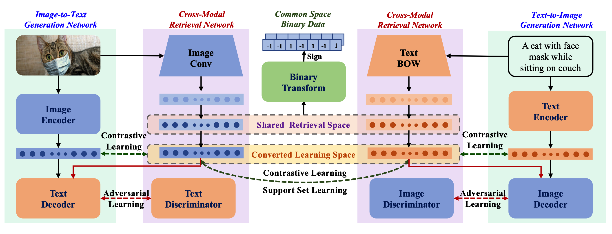

# Image-Text Retrieval via Contrastive Learning with Auxiliary Generative Features and Support-set Regularization

## Model framework




## Requirement

```
h5py==3.2.1
numpy==1.20.3
scipy==1.6.2
torch==1.4.0
torchvision==0.5.0
tqdm==4.61.2
```


## File Description

+ `main.py`, python file used to train student model;
+ `main_binary.py` python file used to train binary model;
+ `scripts/`, training scripts;
+ `src/` , code used to train model;
+ `utils/` , code used for pre-process;
+ `evaluate/` , code used for evaluating;
+ `final_results` , store the evaluate results for 3 datasets;
+ `assests/` , assets files for README;


## Usage

1. run `scprits/{dataset_name}_run.sh` to train student model;
2. run `scripts/{dataset_name}_run_binary.sh` to train binary model;
3. run `evaluate/evaluate_{dataset_name}.py` to obtain the final results. 


## Checkpoints

+ Our model checkpoints could be download from [Google Drive](https://drive.google.com/drive/folders/1Bnpb7Jpbv7hq0mE5iJAV3WxQDcnPQ_wz?usp=sharing);


## Datasets

+ [MS COCO](https://cocodataset.org/#download);
+ [MIRFLICKR-25K](http://press.liacs.nl/mirflickr/mirdownload.html);
+ [NUS-WIDE](https://lms.comp.nus.edu.sg/wp-content/uploads/2019/research/nuswide/NUS-WIDE.html);
